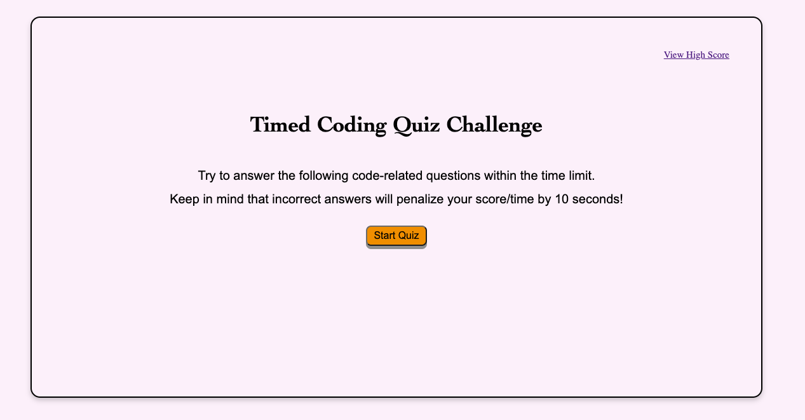
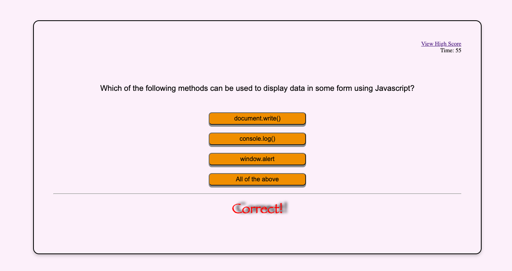
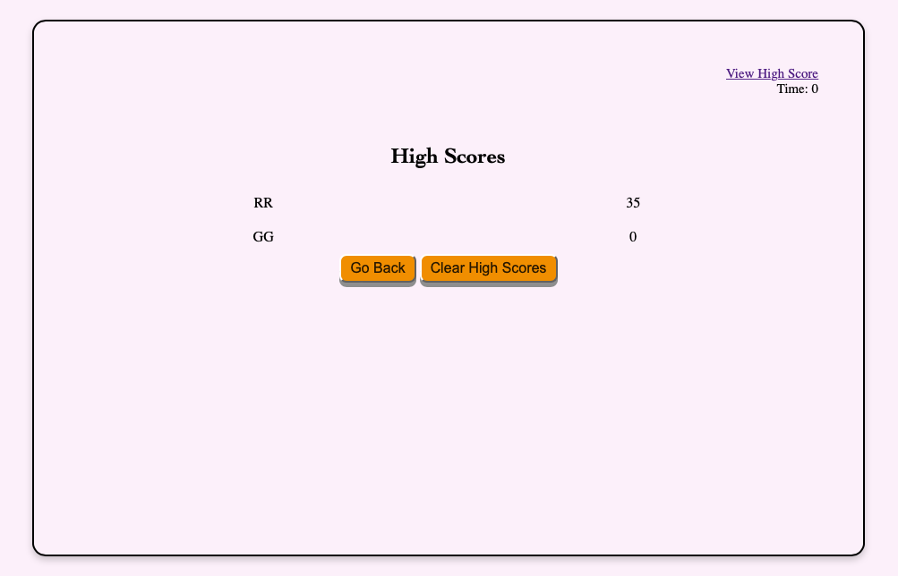
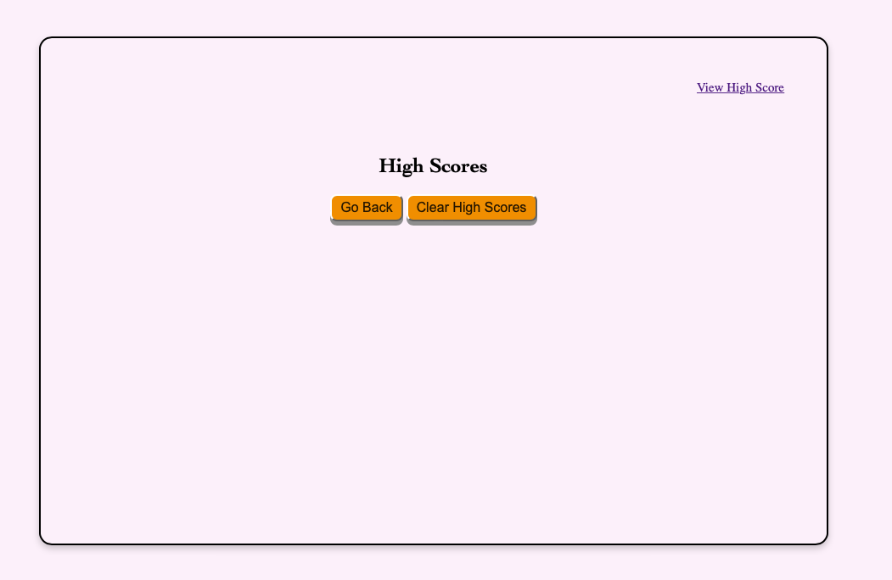

# <Timed Code Quiz 2022>

# A coding quiz testing app

### application that enables student to take a timed quiz Javascript Fundamentals.

 

## Features

- timed quiz when chose the wrong answer time substract by 10 seconds.

- showing final score list

- clear score record and restart function

---
## Project Status
Project is: _completed_ 

## Contact
Created by [Ruihan Gao] - feel free to contact me!

Email: toruig59@gmail.com

Project Link: [https://ahhyaya.github.io/Code-Quiz-2022/](https://ahhyaya.github.io/Code-Quiz-2022/)

